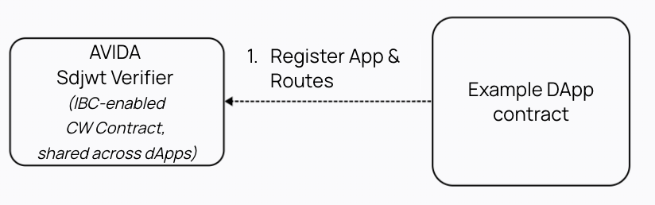
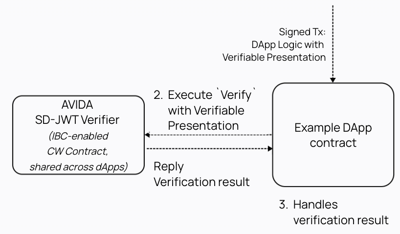

# AVIDA

AVIDA (Atomic Verification of Identity for Decentralised Applications) is a protocol that allows decentralised applications (DApps) to have fine grain access control over their different offerings using Self Sovereign Identity framework and verifiable credentials. This allows onchain users to onboard seamlessly with existing digital identity systems such as the one in the EU - eIDAS, _without reinventing a new standard_.

> At its core, the *verifier* of the [trust triangle](https://trustoverip.github.io/WP0010-toip-foundation-whitepaper/trust/vcred_trust_triangle/) is provided onchain as a smart contract, allowing DApps to verify the credential presentations of their users.

It also provides features to enhance the DApps' ability to manage their users' access control.

AVIDA is agnostic to the underlying credential / presentation format,
the different verification implementations are maintained in this repo.
For example, current verifier code for [SD-JWT](./contracts/sdjwt-verifier) is supported and [anoncreds](./contracts/anoncreds-verifier/) will be updated to the current version.

> If you would like to implement other verification methods, please follow the `trait` provided [here](./packages/common/src/traits.rs) to provide unified interface for DApps developers.


- [AVIDA](#avida)
  - [Usage](#usage)
    - [Concepts: App, Route & Verification Requirements](#concepts-app-route--verification-requirements)
    - [Integrating SD-JWT verifier with DApp](#integrating-sd-jwt-verifier-with-dapp)
    - [Local / Testnet](#local--testnet)
  - [Background and Existing Solutions](#background-and-existing-solutions)
    - [Block / Allow-list of onchain address](#block--allow-list-of-onchain-address)
    - [NFT / Token based gateways](#nft--token-based-gateways)
    - [Comparison to traditional SSI infrastructure](#comparison-to-traditional-ssi-infrastructure)

## Usage

> An example DApp CosmWasm contract using the AVIDA SD-JWT verifier can be found in [avida-example](./contracts/avida-example/).

### Concepts: App, Route & Verification Requirements

- *App*: this is the DApp (represented by an module / contract address) that has one or more routes.
- *Route*: this is the identifier within an App that contains the *Verification Requirements*.
- *Verification Requirements*: this is the data that the verifier will use to verify the credential presentation.

The *Verification Requirements* type is defined in [avida-common](./packages/common/src/types.rs) as:

```rust
pub struct RouteVerificationRequirements {
    /// This defines where the source data for verification is
    /// It can be a source link to the location of the issuer
    /// or the issuer data itself
    pub issuer_source_or_data: IssuerSourceOrData,
    /// The presentation request is the criteria required for the presentation,
    /// for example required certains claims to be disclosed
    /// This value is stored as `VerificationRequirements.presentation_required` on sdjwtVerifier
    pub presentation_required: Binary,
}
```

**Example of `RouteVerificationRequirements` for SD-JWT verifier**:

In the case of using [SD-JWT verifier contract](./contracts/sdjwt-verifier), the `issuer_source_or_data` can be ONE OF the [ResourceReqPacket](./packages/cheqd/src/types.rs) or the JWK public key of the Trusted Issuer.

If it is [ResourceReqPacket](./packages/cheqd/src/types.rs), then the [SD-JWT verifier contract](./contracts/sdjwt-verifier) will create an IBC transaction to query the data stored on the cheqd resource module. The acknowledgement of the IBC transaction is expected to also be in JWK format that represents the JWK public key of the Trusted Issuer. The acknowledgement is handled and stored for the given App and Route.

The `presentation_required`  should be de-serialised to a structure that is meaning for handle the presentation.
For SD-JWT, we will expect the requirements to be some criteria that the disclosed attributes satify.
This is defined as [PresentationReq](./contracts/sdjwt-verifier/src/types.rs)

```rust
// Example
pub type PresentationReq = Vec<(CriterionKey, Criterion)>;
```

### Integrating SD-JWT verifier with DApp

There are 3 core interactions to integrate your smart contract DApp with the AVIDA verifier:
1. *Register your App and Route with the verifier contract*:
This step can be done in 2 ways depending how the administrative rights are managed by the DApp developers.
The `Register` message in SD-JWT takes the caller as the admin of the App, which mean it can be the DApp itself or a separate account.




2. *Updates entry points to send submessage and reply from verifier*:
        1. For smart contracts, add a field in the `ExecMsg` for the user's verifiable presentation for each of the relevant `execute` entry points and return a submessage to the SD-JWT verifier contract type `Verify` with the verifiable presentation.
        2. Handles the verification result from the verifier contract in the `reply` entry point.



3. *Maintain the route verification requirements*:
Administers of DApps can update / remove the route verification requirements by sending `Update` / `Deregister` messages to the verifier contract.

A full example of this was implemented in [avida-example](./contracts/avida-example/).

### Local / Testnet

Run a local netwwork with a cheqd and neutron node by following the instructions in [avida-ts](./avida-ts/README.md) and try out the demo DApp in [avida-example](./contracts/avida-example/).

Alternatively, the [SD-JWT](./contracts/sdjwt-verifier) verifier is deployed on Neutron `pion-1` testnet at `neutron1asg8l0k3wp2a2w0q9kukudq9fnrgfs855pcfdedyqn09fzy2tn3s8p02jq`

---

## Background and Existing Solutions

### Block / Allow-list of onchain address

Many DApps require their users to go through the verification service which then "issue the right to use the service" by adding the users' addresses to an allow-list, which is checked against incoming transactions as an essential part of the application.

The allow-list (allowed address to use the onchain service) are typically managed by the service provider themselves, such as an admin that can update the remove entries in the allow / block list.

This is a mirror of a list maintained offchain,
typically mapping addresses to the users' actual data (such as KYC results and documents).

In the trust triangle, the DApps are both the issuer (mapping onchain address to verification result) and the verifier (onchain allow-list).

This solution is hard to maintain by the DApp when users "credentials" needs to be updated regularly or are revocable.
This puts burden on the onchain services and require continuous state updates onchain with centralised controllers.

### NFT / Token based gateways

Service providers may use onchain data NFT ownerships to provide gated services. Whilst the self sovereign / non-revocable properties are in other circumstances desirable, it is not interoperable with offchain credentials, making it difficult to onboard mainstream users.

A simple example, subscription based business models do not work if service providers cannot revoke credentials if a customer does not pay. Or a community where a member has violated the community rules can have their rights revoked.

### Comparison to traditional SSI infrastructure

Below is a comparison to the normal SSI infrastructure:

| Role | Traditional / Offchain process | AVIDA Onchain Verification process |
|---------- |------------------------------------------------------------------------------------------------------------------------------------------------------------------------------------------------------------------------------------------------------------------------------------------------------------------------------------------------------------------------------------------------------ |------------------------------------------------------------------------------------------------------------------------------------------------------------------------------------------------------------------------------------------------------------------------------------------------------------------------------------------------------------------------------------------------------------------------------------------------------------------------------------------------------------------------------------------------------------------------------------------------------------------------------------------------------------------------------------------------------------------------------------------------------------------------------------------------------------------------------------ |
| **Issuer**| _Trusted issuers such as multiple-car sharing on-boarding service providers._<br /><br />- Commits definitions and schemas to cheqd<br />- Manage updates of revocation on cheqd<br />- Verifies user PID (such as identity and Driving license) and issues credentials to users offchain by offchain protocols such as Aries’ Issue Credential etc | _Trusted issuers can be delegates of an onchain game community._ For example, level up by additional credentials that can be revocable according to set rules e.g. subscription payments or activity.<br /><br />- Same as the traditional process<br />- Same as the traditional process<br />- Verifies onchain activity (such as completed a level) and issues credentials to users offchain by offchain protocols such as Aries’ Issue Credential etc |
| **Holder** | _Holders are users of car sharing services, i.e. someone who would like to use an available car from one of the supported car sharing services_<br /><br />- Stores credential data privately in identity wallet<br />- Upon receiving request from verifier, derive proof based on request nonce, accepted issuers, attributes etc<br />- Sends proof to verifier by offchain protocols such as DID Comms etc | _Holders are users of onchain DApp services, i.e. token holders of the onchain game._<br /><br /><br />- Stores credential data and their onchain private key privately in a “crypto and identity wallet”<br />- Upon choosing a service to interact with, query the service (smart contract / onchain modules) for the required accepted issuers, attributes, etc. The nonce will be the one that is stored on the DApp for this user<br />- Sends proofs to the DApp (as part of the usual business params) |
| **Verifier** | _Verifiers are typically also the service provider, i.e. a car sharing company must verify credentials._<br /><br />- Decides on trusted issuer, attributes / predicates that satisfies their business requirements<br />- Sends proof requests to the holder<br />- Receives and verifies proofs | _The onchain verifier is a separate service to the actual service provider onchain; <br />this allows the AVIDA-verifier to be used by multiple DApps (including the onchain game)._<br /><br />The AVIDA-verifier is implemented as its own smart contract with IBC endpoints to communicate with cheqd resource / did modules.<br />On top of the usual business logic, the DApps are responsible for 2 roles:<br />- To store all the information required for verification, i.e. the list of trusted issuers, attributes, predicates and nonces of accounts to be queried by the AVIDA-verifier<br />- To decide on the interaction-to-proof matrix, i.e. not all interactions need proofs and some might need different proofs to others.<br />Then as soon as the verification result is returned from the AVIDA-verifier, DApps can execute as usual |
